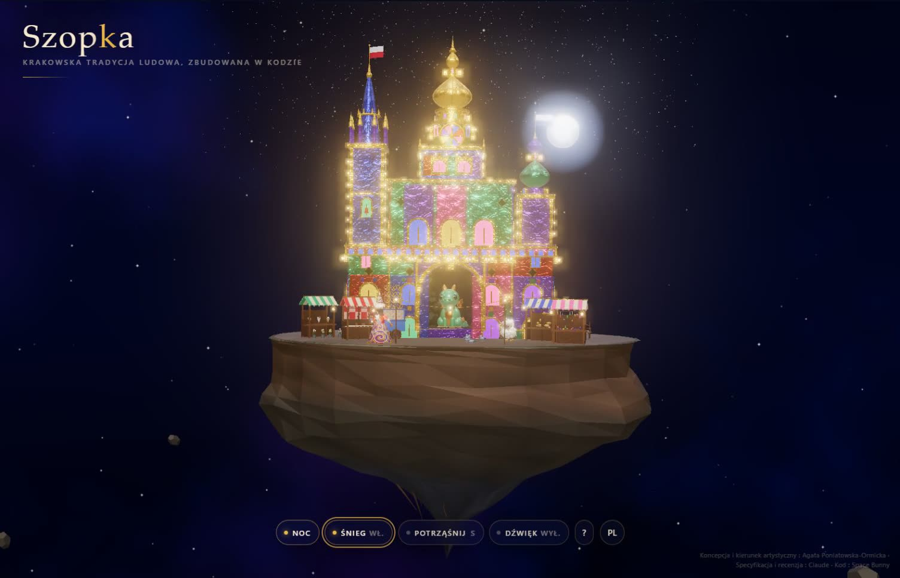

# Szopka

**Krakowska tradycja ludowa, zbudowana w kodzie.**
Interaktywna szopka krakowska w 3D, unosząca się w kosmosie: błyszczące wieże z folii, smok w swojej jamie, jarmark bożonarodzeniowy, śnieg, który można strząsnąć, i fajerwerki nad Krakowem.

**[▶ Otwórz demo na żywo](https://agata-c.github.io/szopka/)** · [English](README.md)

[](https://agata-c.github.io/szopka/szopka-front-360-demo.mp4)

[▶ Obejrzyj 14-sekundowy film](https://agata-c.github.io/szopka/szopka-front-360-demo.mp4)


https://github.com/user-attachments/assets/10ca1381-8b4a-4fd5-b2c4-a7cb3fbd6a2f


---

## Czym jest szopka?

Szopka krakowska to krakowska tradycja ludowa: lśniące, wielowieżowe konstrukcje z tektury i kolorowej folii, inspirowane kościołami i zabytkami miasta. Jest wpisana na listę niematerialnego dziedzictwa kulturowego UNESCO. Co roku, w pierwszy czwartek grudnia, szopkarze przynoszą swoje szopki na Rynek Główny w Krakowie, gdzie odbywa się konkurs.

Ta szopka jest cyfrowa. Wszystko, co widzisz, od każdej wieży po każdy płatek śniegu i precel, jest wygenerowane w kodzie. Nie ma tu żadnych plików graficznych ani modeli 3D.

## Co możesz zrobić

| Akcja | Co się dzieje |
|---|---|
| Przeciągnij / przewiń / uszczypnij | Obracanie i przybliżanie wyspy |
| Kliknij smoka | Smok Wawelski zieje ogniem (SMS niepotrzebny) |
| Kliknij Lajkonika | Stuknięcie buławą przynosi rok szczęścia |
| Kliknij owcę, bacę albo kominiarza | Każde z nich reaguje |
| Kliknij okno hejnalisty | Hejnalista gra hejnał z wieży |
| Kliknij niebo | Fajerwerki |
| Kliknij dwukrotnie lub naciśnij **S** | Potrząśnij wyspą i patrz, jak spada śnieg |
| Naciśnij **C** | Przywołaj kometę |
| Dzień / Noc · Śnieg · Dźwięk | Przyciski na dole |
| PL / EN | Zmiana języka |

Psst... gdzieś przy smoku może kryć się sekretny klawisz.

## Krakowskie szczegóły ukryte w scenie

- **Smok Wawelski** mieszka w jamie. Według legendy pokonała go owca wypchana siarką, dlatego owca stoi tuż obok niego. (Prawdziwy smok pod Wawelem zieje ogniem po wysłaniu SMS-a. Ten robi to za darmo.)
- **Lajkonik**, brodaty jeździec na koniku, który co roku w czwartek po Bożym Ciele tańczy w pochodzie przez Kraków.
- **Hejnał**, grany co godzinę z wieży Mariackiej. Urywa się w połowie, na pamiątkę trębacza trafionego strzałą, gdy ostrzegał miasto. Tutaj też gra o pełnej godzinie.
- **Jarmark**: obwarzanki i precle na niebieskim wózku, kwiaty (sprzedawane na Rynku przez cały rok), oscypki, piernikowe serca i ręcznie dmuchane szklane bombki.
- **Kominiarz**, polski symbol szczęścia: kiedy go zobaczysz, złap się za guzik.
- **Baca** ze stadem owiec i **krakowskie gołębie**.
- Flaga **Polski** i flaga **Krakowa** na wieżach.

## Jak powstała

Ten projekt to eksperyment w **reżyserowaniu AI przy tworzeniu grafiki**, bez narysowania ręcznie ani jednego piksela.

- **Koncepcja, kierunek artystyczny, referencje i wszystkie decyzje projektowe:** Agata Poniatowska-Ormicka
- **Projekty postaci:** smok i owca zostały zaprojektowane w Midjourney jako zabawki typu „vinyl toy”, a potem przełożone na kod kształt po kształcie
- **Specyfikacja techniczna i review kodu:** Claude (Anthropic)
- **Kod:** Space Bunny, model „stealth” w OpenCode, w około 30 rundach
- **Muzyka i efekty dźwiękowe:** stworzone w Suno
- **Nagranie hejnału:** [Wikimedia Commons](https://commons.wikimedia.org/wiki/File:Cracow_trumpet_signal.ogg) (domena publiczna)

Praca szła rundami: precyzyjna specyfikacja, budowa, przegląd kodu i zrzutów ekranu, poprawki. Każda runda zmieniała tylko to, o co prosiłam.

**Technologia:** jeden plik `index.html` z [Three.js](https://threejs.org/) (r169, z CDN) i Web Audio API. Cała geometria, tekstury (folia, skała, koronka, haft) i animacje są proceduralne.

## Uruchomienie lokalne

Dźwięki ładują się przez HTTP, więc otwórz projekt przez mały lokalny serwer, a nie przez dwuklik na pliku:

```bash
npx serve .
```

albo

```bash
python -m http.server 8000
```

Potem otwórz `http://localhost:8000` (albo adres, który poda `serve`).

## Licencja

**Szopka**, autorka **Agata Poniatowska-Ormicka**, jest udostępniona na licencji [CC BY 4.0](https://creativecommons.org/licenses/by/4.0/deed.pl). Możesz ją udostępniać i przerabiać, także komercyjnie, pod warunkiem podania autorstwa. Jeśli coś na niej zbudujesz, oznacz mnie albo podlinkuj, sprawisz mi tym ogromną radość.

Elementy zewnętrzne mają własne warunki: Three.js (MIT) oraz nagranie hejnału (domena publiczna, Wikimedia Commons).

